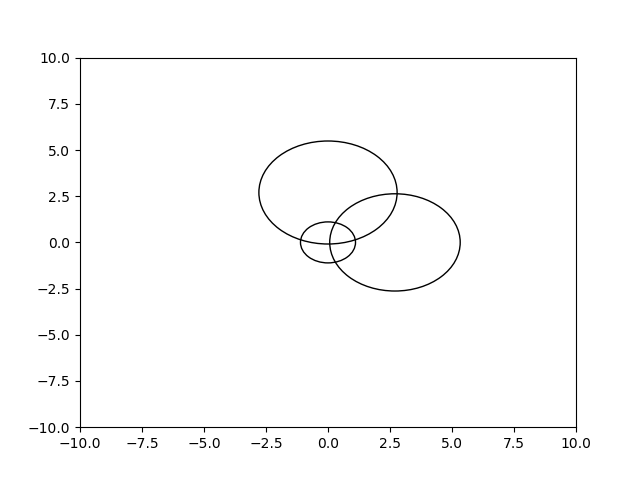

## What?

Our goal was to create a noninvasive location tracker through a confined space. Our solution provides store owners/managers with a tool to see where their consumers spend most of their time without invading the customer's right to privacy. Our goal is that the merchant incentivizes the consumer with a discounted purchase so that the store can collect data about where to optimally place products.

Usage of the product is entirely up to the consumer, and the beauty of the product is that it stops tracking a user's location beyond the confines of a store.

**DISCLAIMER:** This product does not violate a consumer's right to privacy, as it ends tracking by the time the consumer leaves the predefined confines of the system.

## How it works

Given a beacon at position (<i>Xa, Ya</i>), a user's distance from the router can be calculated through a transformed form of the Free Space Path Loss (FSPL) formula. Through communicating with the wi-fi emitted from the beacon, a computer can calculate the signal strength in dBm and the frequency in MHz. When plugged into the following equation, where f is the frequency and s is the signal strength, a distance *d* in meters is returned.

While this was a great start, the problem persisted as to finding the user's specific location. The equation returns a distance between the user and the beacon, which forms a circle around the beacon of radius *d*. In order to track the precise location, we used a technique known as *trilateration* (very similar to *triangularation* in GPS's). When we use *n*=3 beacons, we can plot three different circles and thereby get a much more precise area as to where the user could be through optimization with least squares approximation. As can be seen with a simple graph below, the area of overlap between all three beacons can be used to generalize a location within a given confined area.

 

## Computational Technicalities/Specifications
A computer is used in the middle (can be as portable as an Raspberry Pi if plugged into a portable charger; we were lacking in resources so we used a laptop) to communicate with all three beacons. The computer recursively disconnects with a Wi-Fi connection, communicates with each beacon, calculates the location, then communicates with a GCP back-end via a RESTful API, mimicking multilateral U-TDOA technology that's used to geolocate cell phones. Mathematical models were originally drafted in Python, but were ported to a Node.js back-end for powerful and asynchronous network tools. 

## Challenges/Responsibilities
This was a first in multiple ways for all of us. Henry, Andy, and Saul came to PennApps hoping to build some kind of deep learning project as that's where their interests lay. Nathan was originally responsible for front-end interactivity. However, after arriving and spending all of Friday night brainstorming ideas and working out a lot of what ended up being useless complicated math, we decided to go with something unique and explore territories we've never dealt with in the past. None of us have ever worked with network engineering or hardware hacking, so this entire experience was brand new for all of us. Henry and Andy spent a lot of the original time writing bash scripts and mathematical models for network analyses. Nathan spent a good part of the later half of Saturday implementing the abstractions with his specialties in JavaScript (the other three mainly do Python development). Saul, being a Physics grad student right here at Penn, was able to help in both facets a myriad of times where/when needed. He was primarily responsible for the actual trilateration models in Python that then became much easier to port to JavaScript.

Also, due to the use of multiple phones and OSes as beacons, the signals weren't uniform and often resulted in diverging plots, which led to the necessity of more approximation functions. In production, all three beacons will be identical for more uniform signal analysis.

## Future Plans
We plan to implement this in small shops so that they know how to optimally organize their materials for consumers who want them at a given time and place. As brick and mortar shops are quickly succumbing to large online retail stores, this will help small businesses boost profits and hopefully attract more consumers away from online retail and toward their own business. We will also move into RF technology to eliminate the dependence on internet in lower-income areas of the country and world. For more precision, we could potentially add more nodes for linear scalability. 
