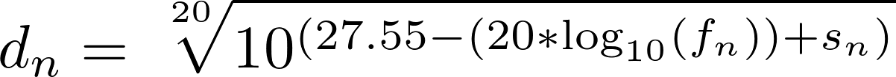

# TriFi
Trilateration of location via internet hotspot signal strength analysis

## What?

Our goal was to create a noninvasive location tracker through a confined space. Our solution provides store owners/managers with a tool to see where their consumers spend most of their time without invading the customer's privacy too much. Our goal is that the merchant incentivizes the consumer with a discounted purchase so that the store can collect data about where to optimally place products.

**THIS DOES NOT VIOLATE A CONSUMER'S INDIVIDUAL PRIVACY**

Usage of the product is entirely up to the consumer, and the beauty of the product is that it stops tracking a user's location beyond the confines of a store.

## How it works

Given a beacon at position (<i>Xa, Ya</i>), a user's distance from the router can be calculated through a transformed form of the Free Space Path Loss (FSPL) formula. Through communicating with the wi-fi emitted from the beacon, a computer can calculate the signal strength in dBm and the frequency in MHz. When plugged into the following equation, where f is the frequency and s is the signal strength, a distance *d* in meters is returned.

While this was a great start, the problem persisted as to finding the user's specific location. The equation returns a distance between the user and the beacon, which forms a circle around the beacon of radius *d*. In order to track the precise location, we used a technique known as *trilateration* (very similar to *triangularation* in GPS's).
