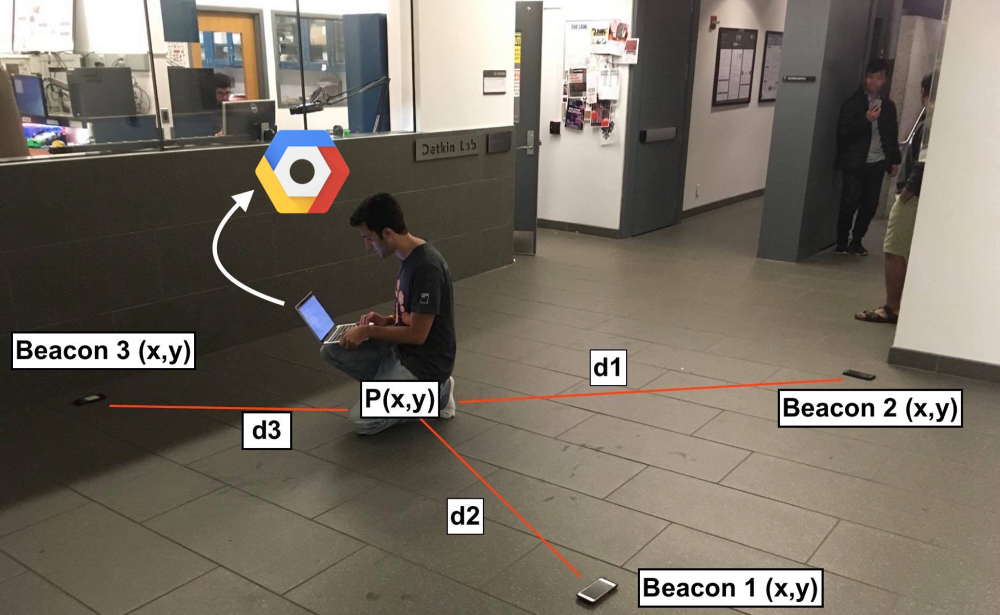

# TriFi
Trilateration of location via internet hotspot signal strength analysis

## What?

Our goal was to create a noninvasive location tracker through a confined space. Our solution provides store owners/managers with a tool to see where their consumers spend most of their time without invading the customer's privacy too much. Our goal is that the merchant incentivizes the consumer with a discounted purchase so that the store can collect data about where to optimally place products.

**THIS DOES NOT VIOLATE A CONSUMER'S INDIVIDUAL PRIVACY**

Usage of the product is entirely up to the consumer, and the beauty of the product is that it stops tracking a user's location beyond the confines of a store.

## How it works

